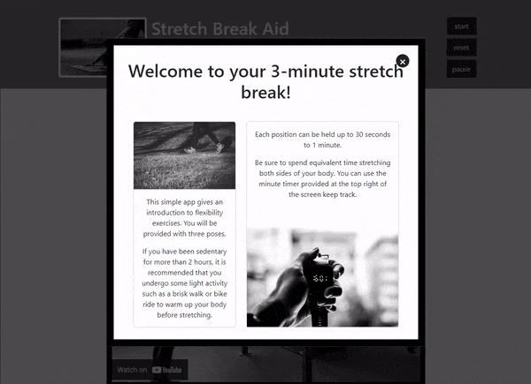
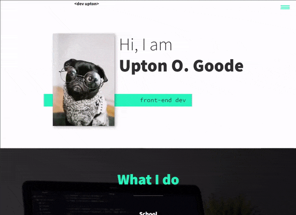
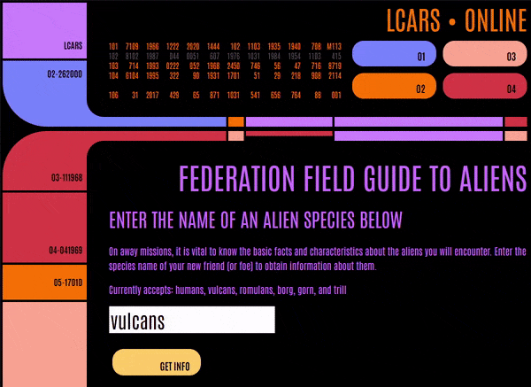
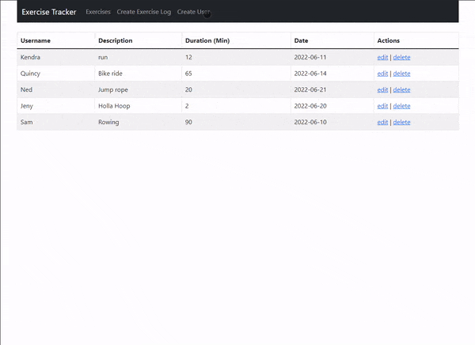

<h1> Welcome to my github!  </h1>

  
  
  
  
  

<h1> About Me </h1>

 🔭 I’m currently working on a virtual personal training platform.

 🌱 I’m currently learning React.js

 👯 I’m looking to collaborate with other enthusiastic developers. 

 💬 Ask me about my favorite D&D class. 

 ⚡ Fun fact: I ran with bulls in Pamplona, Spain.

<h1> Skills </h1>
  
 

    
    
    
    
    
    
    
    
    
    
    

 
  
<h1 align="center">Projects</h1>
<table bordercolor="#66b2b2">
  
  <tr>
    <td width="50%" valign="top">
      <h3 align="center">Exercise Library</h3>
         
            
         
        

          
    
  
      

        
 - <strong>JS, Node, Express, MongoDB</strong> - 
           Companion app for an exercise database that provides directions for a 3-minute stretch break.

    </td>
    <td width="50%" valign="top">
      <h3 align="center">Portfolio Website</h3>
         
            
         
        

          
  
  
      

        
 - <strong>HTML, CSS, JS</strong> - 
           Static webpage to display a sample portfolio for a front-end dev.

    </td>
  </tr>

  <tr>
    <td width="50%" valign="top">
      <h3 align="center">Star Trek Alien Lookup</h3>
         
            
         
        

          
    
  
      

        
 - <strong>HTML, CSS, JS, Node, Express, MongoDB</strong> - 
           A form to look up alien races from the Star Trek universe inspired by the Library Computer Access/Retrieval System (LCARS) from the franchise.

    </td>
    <td width="50%" valign="top">
      <h3 align="center">Activity Tracker</h3>
         
            
         
        

          
  
  
      

        
 - <strong>React, JS, Node, Express, MongoDB</strong> - 
           Data from a custom api is logged using react components into an app that monitors physical activity among the database users.

    </td>
  </tr>

</table>

<h2> Some Programming Humor </h2>

